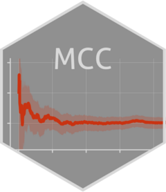

<!-- README.md is generated from README.Rmd. Please edit that file -->

```{r, include = FALSE}
knitr::opts_chunk$set(
  collapse = TRUE,
  comment = "#>",
  fig.path = "man/figures/README-",
  out.width = "100%"
)
```

# MCC 

<!-- badges: start -->
[](https://lifecycle.r-lib.org/articles/stages.html#experimental)
[](https://orcid.org/0000-0002-8407-4618)
[](https://doi.org/10.1093/aje/kwu289)
<!-- badges: end -->

The goal of MCC is to compute the mean cumulative count of a recurrent event

## Installation

You can install the development version of MCC like so:

``` r
devtools::install_github("tjuheide/MCC")
```
