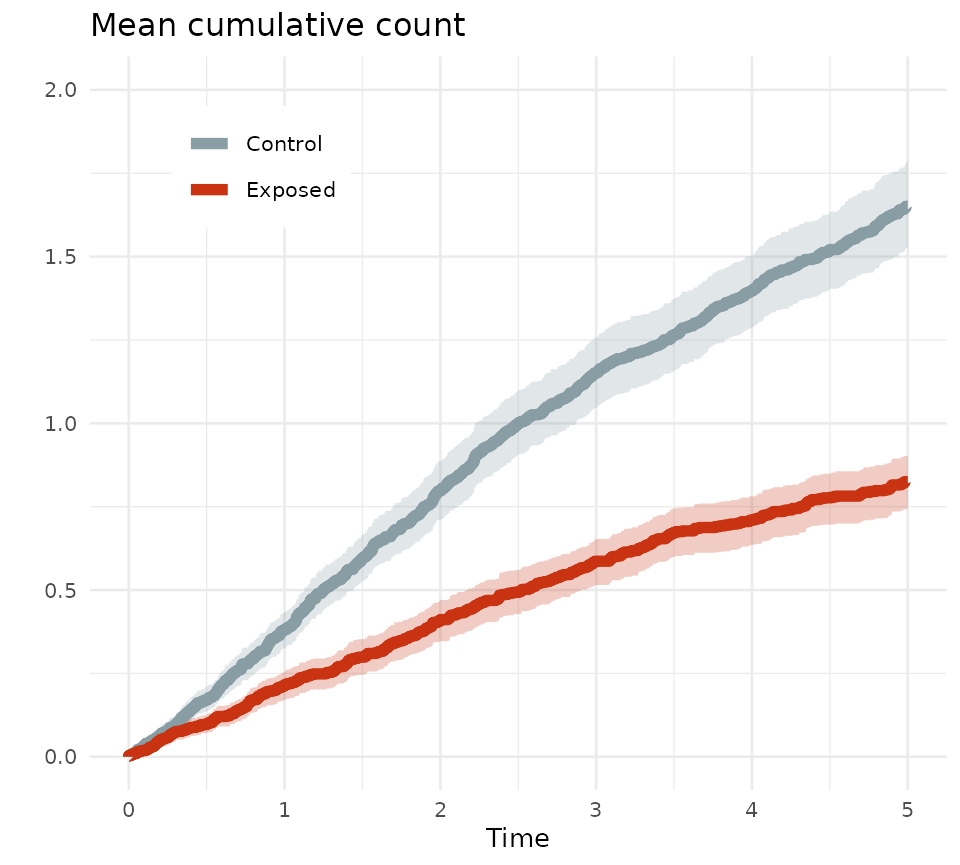

# MCC overview

``` r

library(MCC)
library(data.table)
library(ggplot2)
library(pammtools)

# colors from the wesanderson package/Royal1-palette used for plots
mypal <- c("#899da4", "#c93312")
```

The purpose of the MCC package is to compute the mean cumulative count
(see <https://doi.org/10.1093/aje/kwu289>) of events when these can
happen repeatedly during follow-up.

The mcc-function allows for weights, which are assumed to be constant
throughout follow-up for the individual.

Below is an example using built in data (not representing any real
population, exposure, or outcome).

``` r


# load built in data
data("mcc_events")


# data on times and recurrent events within an exposure and control group.
# A weight is provided to balance measured covariates (covariates not provided)
str(mcc_events)
#> Classes 'data.table' and 'data.frame':   2165 obs. of  5 variables:
#>  $ id    : Factor w/ 1000 levels "1","2","3","4",..: 1 1 1 1 2 2 3 3 4 5 ...
#>  $ grp   : Factor w/ 2 levels "Control","Exposed": 2 2 2 2 1 1 1 1 1 1 ...
#>  $ weight: num  0.907 0.907 0.907 0.907 0.892 ...
#>  $ time  : num  1.63 1.66 2.16 3.09 3.04 ...
#>  $ event : int  1 1 1 2 1 0 1 0 0 1 ...
#>  - attr(*, ".internal.selfref")=<pointer: (nil)>
```

MCC expects data with one observation per event per individual,
including an observation at the end of follow-up, i.e., for all
individuals there must be a censoring (coded 0) or competing event
(coded 2) and this must happen at their last time of follow-up. There
can also be an event of interest at this time.

``` r

# most observations will probably have events at distinct times and either be
# censored or die/get a competing event at the last time without an event there.
head(mcc_events,9)
#>        id     grp    weight     time event
#>    <fctr>  <fctr>     <num>    <num> <int>
#> 1:      1 Exposed 0.9065762 1.632877     1
#> 2:      1 Exposed 0.9065762 1.663014     1
#> 3:      1 Exposed 0.9065762 2.156164     1
#> 4:      1 Exposed 0.9065762 3.087671     2
#> 5:      2 Control 0.8924532 3.038356     1
#> 6:      2 Control 0.8924532 5.000000     0
#> 7:      3 Control 1.0718638 1.865753     1
#> 8:      3 Control 1.0718638 5.000000     0
#> 9:      4 Control 0.9049045 5.000000     0


# however, it can happen that an individual gets an event and is either
# censored or die at the same observed time. This is not an issue.
mcc_events[id == 603]
#>        id     grp   weight     time event
#>    <fctr>  <fctr>    <num>    <num> <int>
#> 1:    603 Exposed 0.982151 3.290411     0
#> 2:    603 Exposed 0.982151 3.290411     1
```

The checkData-function can be used to check for obvious errors in the
data:  
- events must be coded 0, 1, 2;  
- the last observation for the individual must be either 0 or 2;  
- intermediate events must be 1;  
- time must be non-negative;  
- if weights are applied they must be constant throughout follow-up If
the function returns NULL then it did not detect any obvious errors.

``` r

# check integrity of data
x <- checkData(data = mcc_events,
               idvar = "id",
               timevar = "time",
               eventvar = "event",
               weightvar = "weight")
```

The data can be analyzed using the mcc-function. This returns estimates
of the mean cumulative count for each time point observed within the
specific group.

``` r

# estimating the mean cumulative count within groups using the mcc-function
estimate <- mcc(data = mcc_events,
                idvar = "id",
                timevar = "time",
                eventvar = "event",
                grpvar = "grp",
                weightvar = "weight")
```

To get a measure of variability, bootstrap samples from a built in data
set are used (500 samples).

``` r

# loading built in data on with bootstrap samples
data("mcc_events_bs")


# BootstrapSample and grp are combined so that only one call of the
# mcc-function is necessary, grouping by the new variable
mcc_events_bs$group <- paste(mcc_events_bs$grp,mcc_events_bs$BootstrapSample,
                             sep = "-")


# the mcc-function is used within groups in each bootstrap sample
bsestimate <- mcc(data = mcc_events_bs,
                  id = "id",
                  time = "time",
                  event = "event",
                  grp = "group",
                  weight = "weight")


# note that the name of the group variable is grp, regardless of the name in the
# input data
str(bsestimate)
#> Classes 'data.table' and 'data.frame':   425664 obs. of  8 variables:
#>  $ grp              : chr  "Control-1" "Control-1" "Control-1" "Control-1" ...
#>  $ time             : num  0 0 0.00274 0.01918 0.0274 ...
#>  $ atrisk           : num  514 514 514 514 514 ...
#>  $ km               : num  1 1 1 1 1 1 1 1 1 1 ...
#>  $ mcc              : num  0 0.00202 0.00418 0.00616 0.00814 ...
#>  $ censored         : num  0 0 0 0 0 0 0 0 0 0 ...
#>  $ event_of_interest: num  0 1.04 1.11 1.02 1.02 ...
#>  $ competing_event  : num  0 0 0 0 0 0 0 0 0 0 ...
#>  - attr(*, ".internal.selfref")=<pointer: 0x55d761890ee0>
```

In order to be able to compare the two groups at any given time point
(observed or specified), and to have the same number of bootstrap
estimates at each time point, the expandMCC-function is called. This
makes an observation at all observed time points (across groups) and at
time points specified in the function call in all groups.

Note that estimates will not be provided for time points coming after
the last observation in a specific group. I.e., if in group A an event
happens at time 10, but in group B no one is followed beyond time 8,
then no estimate at time 10 will be provided in group B. If
bootstrapping is applied, this may result in fewer bootstrap estimates
at late follow-up, if only few individuals are followed for a long time.
If follow-up is generally shorter than 5 years, say, and only one
individual is followed for longer, then for bootstrap samples not
including this individual, there will be no estimate beyond 5 years.

``` r

# expandMCC is used to get an estimate at all observed times and at time 1-6
# (if time 1-6 is already seen in the data, this will add nothing).
# NB the longest observed time is 5, thus asking for a estimate at time 6 will
# return a warning, and no estimate will be supplied in the output
est <- expandMCC(mcc_est = estimate, times = c(1,2,3,4,5,6))
#> [1] "Warning:"
#> [1] "A specified time point exceeds the follow-up in a group."
#> [1] "Estimates beyond the observed follow-up will not be made."


# (only times 1-5 requested in the bootstrap samples)
bs <- expandMCC(mcc_est = bsestimate, times = c(1,2,3,4,5))


# variables BootstrapSample and grp are recreated from grp
bs$BootstrapSample <- factor(sub('.*-', '', bs$grp))
bs$grp <- factor(ifelse(startsWith(bs$grp, "Control"), "Control", "Exposed"),
                 levels = c("Control", "Exposed"))
```

Combining the results from the bootstrap samples and the actual data
makes it possible to plot MCC against time, and report estimates with
95% CIs at specific times.

``` r

# estimating 95% CI at every time point based on the sampling (bootstrap)
# distribution
cl <- bs[, .(lcl = quantile(mcc, .025), ucl = quantile(mcc, .975)),
         by = c("grp", "time")][est, on = c("grp", "time")]


# plotting the mean cumulative count with 95% CI-bands against time
# for the 2 groups
ggplot(cl, aes(x = time, y = mcc, color = grp, fill = grp)) +
  geom_stepribbon(alpha = .25, aes(ymin = lcl, ymax = ucl, color = NULL),
                  show.legend = FALSE) +
  scale_fill_manual(values = mypal) +
  scale_color_manual(values = mypal) +
  geom_step(linewidth = 2) +
  labs(y = "", x = "Time", title = "Mean cumulative count") +
  coord_cartesian(ylim = c(0,2), xlim = c(0,5)) +
  theme_minimal(base_size = 10) +
  theme(legend.position = c(.2,.85),
        legend.title = element_blank(),
        legend.background = element_rect(fill = "white", color = "white"))
```



``` r


# yearly MCC estimates within groups
cl[time %in% c(1,2,3,4,5), .(grp, time, mcc, lcl, ucl)]
#>         grp  time       mcc       lcl       ucl
#>      <fctr> <num>     <num>     <num>     <num>
#>  1: Control     1 0.3819464 0.3272210 0.4352758
#>  2: Control     2 0.7976654 0.7111200 0.8861932
#>  3: Control     3 1.1507593 1.0463561 1.2569894
#>  4: Control     4 1.3974719 1.2856592 1.5032377
#>  5: Control     5 1.6509666 1.5247917 1.7844171
#>  6: Exposed     1 0.2142607 0.1702317 0.2547290
#>  7: Exposed     2 0.4113603 0.3467663 0.4702224
#>  8: Exposed     3 0.5864469 0.5151989 0.6532670
#>  9: Exposed     4 0.7102156 0.6357852 0.7807951
#> 10: Exposed     5 0.8252094 0.7426318 0.9022471
```

The groups can be compared to quantify differences. Here a mean
cumulative count ratio is computed and plotted against time, and
tabulated yearly.

``` r

# computing the MCC ratio
mccratio <- est[grp == "Exposed" & time > 0] |>
  _[est[grp != "Exposed" & time > 0],on = c("time"),
    .(time, ratio = mcc / i.mcc)]

clratio <- bs[grp == "Exposed" & time > 0] |>
  _[bs[grp != "Exposed" & time > 0],on = c("time", "BootstrapSample"),
    .(time, ratio = mcc / i.mcc)] |>
  _[, .(lcl = quantile(ratio, .025, na.rm = T),
        ucl = quantile(ratio, .975, na.rm = T)), by = time] |>
  _[mccratio, on = c("time")] |>
  _[!is.na(ucl) & lcl > 0]


# plotting the ratio against time
ggplot(clratio, aes(x = time, y = ratio)) +
  geom_ribbon(aes(ymin = lcl, ymax = ucl),
              alpha = .25, color = "transparent", fill = mypal[2]) +
  geom_line(linewidth = 1.5, color = mypal[2]) +
  scale_y_log10(breaks = c(.25,.5,1,2,4)) +
  coord_cartesian(ylim = c(.15,6)) +
  labs(y = "", x = "Time", title = "Mean cumulative count ratio") +
  theme_minimal()
```


``` r


# yearly MCC ratios
clratio[time %in% c(1,2,3,4,5), .(time, ratio, lcl, ucl)]
#>     time     ratio       lcl       ucl
#>    <num>     <num>     <num>     <num>
#> 1:     1 0.5609704 0.4304832 0.6999795
#> 2:     2 0.5157053 0.4249083 0.6067041
#> 3:     3 0.5096174 0.4373435 0.5826434
#> 4:     4 0.5082146 0.4411198 0.5770182
#> 5:     5 0.4998341 0.4366818 0.5615709
```
